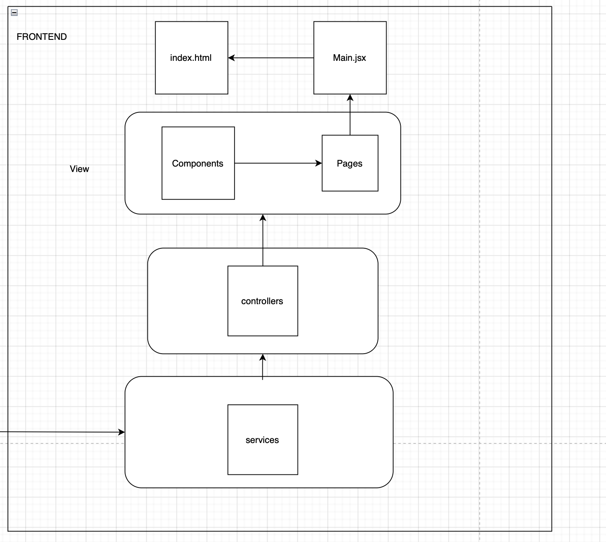

# 🚀 Quick Start

Om het project te starten, moet je zowel de Flask API als de lokale UI draaien.

## 🐍 Hoe start je de Flask API
- Zorg dat je Python 3.12 of hoger op je machine hebt geïnstalleerd.
- Installeer de benodigde packages 📦
- Navigeer naar `app.py` en voer het bestand uit ▶
- De API draait vervolgens op: [http://127.0.0.1:5000](http://127.0.0.1:5000)

## 💻 Hoe start je de UI
- Navigeer naar de `frontend` map in de terminal → `cd frontend`
- Installeer de benodigde packages met `npm install` 
- Start de UI met `npm run dev` 
- De UI is bereikbaar op: [http://localhost:5173/INNO/](http://localhost:5173/INNO/)

---

# 🏗️ Architectuur

## 🔧 Back-end
...

## 🎨 Front-end

### 🖼️ Plaatje

### 🔄 Services
De services maken gebruik van de Flask API om simulatiegegevens op te halen en weer te geven in de UI. Daarnaast ontvangen ze gebruikersinvoer vanuit de UI en sturen deze door naar de simulatie.

### 🧭 Controller
De controller dient als schakel tussen de UI en de services. Volgens de conventies van MVC is de controller verantwoordelijk voor het afhandelen van gebruikersinvoer en het aanroepen van de juiste services. Daarnaast presenteert de controller de verwerkte gegevens aan de gebruiker via de view.

### 👁️ View
De view-laag is verantwoordelijk voor het weergeven van de gegevens uit de simulatie aan de gebruiker in de vorm van een visuele interface (UI).

#### 🧩 Components
Dit zijn de herbruikbare onderdelen van de UI die op verschillende pagina’s worden gebruikt.

#### 📄 Pages
De pagina’s zijn de verschillende schermen die de gebruiker kan zien. Elke pagina maakt gebruik van componenten om gegevens weer te geven en interactie mogelijk te maken. De standaardroute met de URL `/` verwijst naar de `config.jsx` pagina.

#### Styles 🖌️
Hierin zitten de CSS-bestanden die de styling van de UI componenten en pagina's regelen.

##### 🌐 `root.jsx`
De `root.jsx` bevat alle routes naar de verschillende pagina's en vormt daarmee het centrale punt voor de routing.

---

# ❓ Questions & Answers
